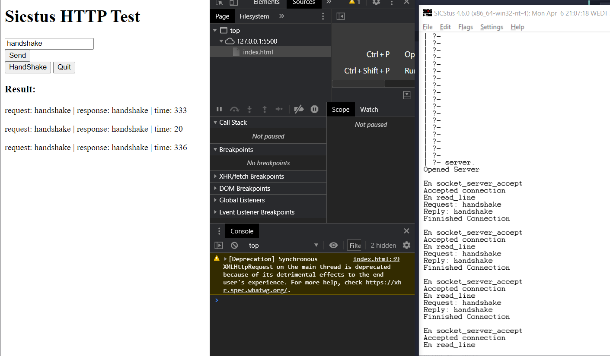

# ServidorProlog

Alguns pedidos demoram 20 ms enquanto outros demoram 300ms. Isto porque o programa em prolog, quando fica bloqueado à espera de resposta não fica sempre no mesmo predicado. Quando fica bloqueado no predicado `socket_server_open`, o pedido seguinte demora 300ms a ser processado. Quando fica bloqueado em `read_line` só demora 20ms.

O ideal seria que demorasse sempre o menor tempo possivel, mas não se percebe porque é que alterna entre estes dois estados

